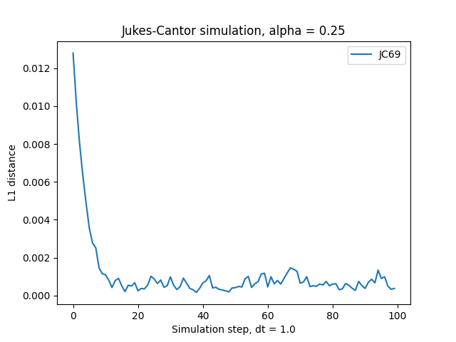
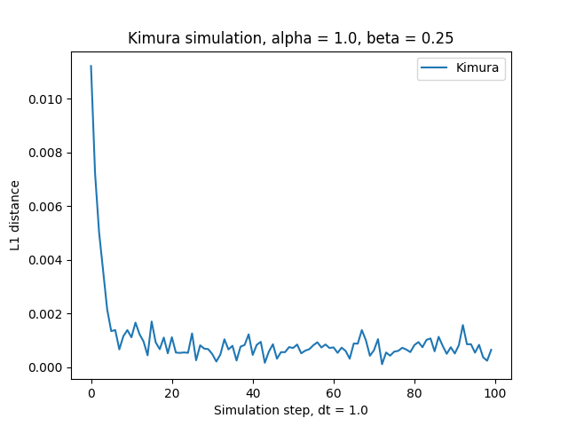
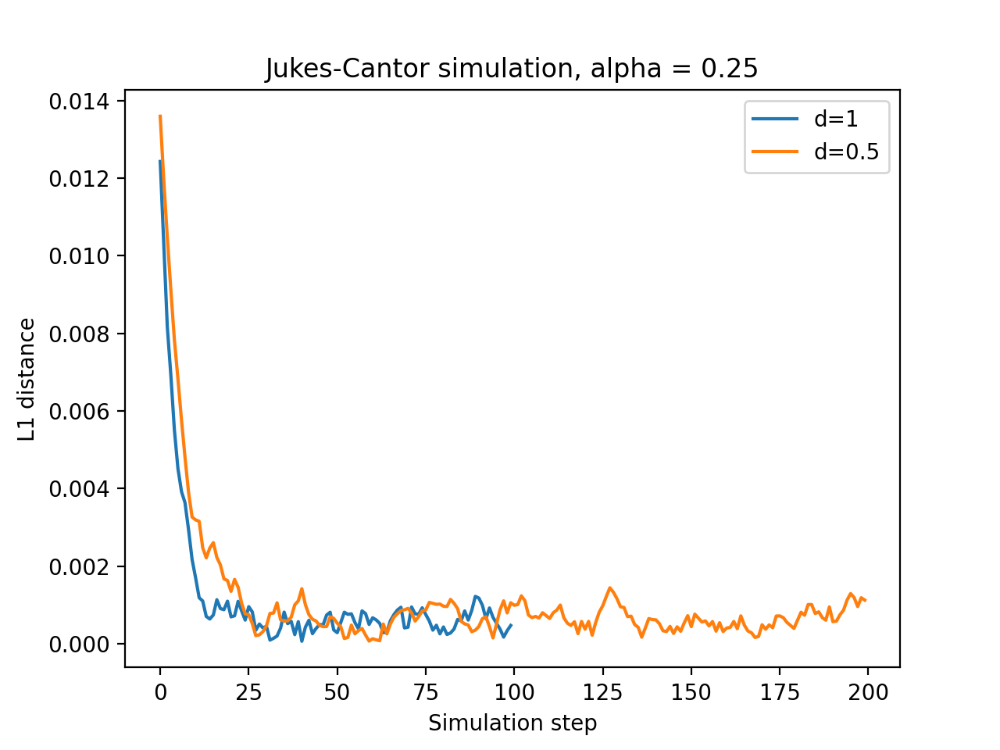

# GP_EvoSimulation

Evolution models simulator

# Example

```bash
# Jukes-Cantor model simulation from NCBI sequence ID
./evo_sim.py U00096.3 jukes-cantor --time=1.0 --steps=100 --alpha=0.25 -o sim_JC.png

# Jukes-Cantor model simulation from file
./evo_sim.py demo/U00096.3.fasta jukes-cantor --time=1.0 --steps=100 --alpha=0.25 -o sim_JC.png

# same for Kimura model
./evo_sim.py demo/U00096.3.fasta kimura --time=1.0 --steps=100 --alpha=1.0 --beta=0.25 -o sim_K.png
```

<html>
<body>
    <div>
        <h4>Jukes-Cantor model simulation</h4>
        <p>
            
        </p>
        <h4>Kimura model simulation</h4>
        <p>
            
        </p>
        <h4>Jukes-Cantor models with different parameters</h4>
        <p>
            
        </p>
    </div>
</body>
</html>
